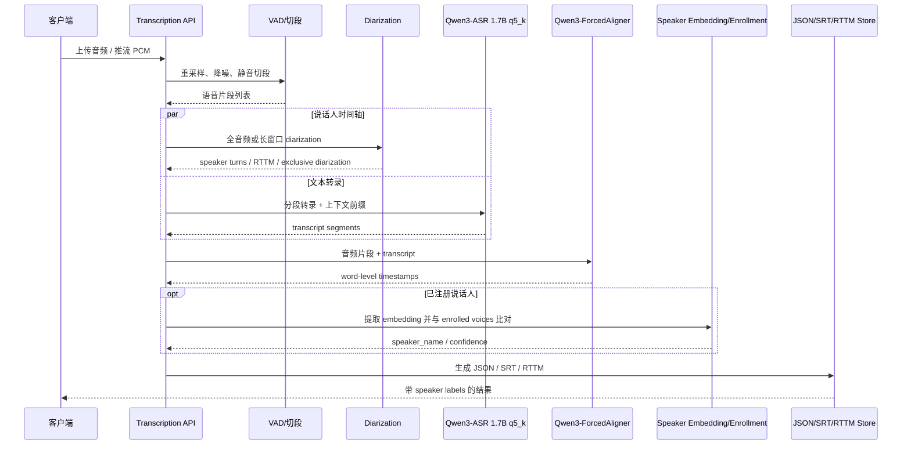

# Qwen3-ASR-1.7B 在两台目标机器上的部署、量化与说话人归属调研

## 执行摘要

Qwen3-ASR-1.7B 是一个“语音编码器 + Qwen3-1.7B 解码器”的大语音语言模型：官方技术报告明确写到，1.7B 版本由 **300M 参数的 AuT 编码器**、投影层和 **Qwen3-1.7B** 解码器组成，支持 **30 种语言 + 22 种中文方言**，单次离线推理的音频长度上限是 **20 分钟**，并且官方工具链重点覆盖了 **Transformers / vLLM / streaming / forced alignment**。这意味着它本身很强，但“说话人归属”并不是官方主线，需要额外接入 diarization 或 speaker embedding 模块。citeturn34view0turn35view0turn42view0

对你的两台目标机器，我的结论很明确。**Mac Studio M1 Max 64GB** 上，如果你把 **q5_k GGUF** 作为优先项，最值得走的是 **GGUF/Metal 路线**，尤其是 **CrispASR** 这类专门支持 Qwen3-ASR GGUF 的 C++ 运行时，或“**ONNX 编码器 + GGUF 解码器**”这种混合式方案；纯 ONNX Runtime 在 macOS 上没有标准的 Metal Execution Provider，官方加速路径其实是 **CoreML EP**，因此在 Apple Silicon 上通常不如 **MLX / GGUF + Metal** 直接。对 **RTX 3060 + 16GB RAM** 这台机器，如果是**桌面版 3060 12GB**，那么 **官方 PyTorch/vLLM CUDA** 与 **GGUF q5_k** 两条路都能跑，且速度都大概率够用；如果是 **Laptop 3060 6GB**，则建议直接放弃 BF16，全程优先 **q5_k / Q4_K_M / 分离式 ONNX+GGUF**。NVIDIA 官方规格页显示桌面 RTX 3060 常见为 **12GB**，而笔记本 RTX 3060 为 **6GB**。citeturn26search1turn26search6turn28search0turn28search2turn29search0turn29search4

如果你的目标不是“先把模型跑起来”，而是“**本地、可持续、可扩展地做多说话人转录**”，那么今天最稳妥的工程建议是：**ASR 用 Qwen3-ASR-1.7B；时间戳用 Qwen3-ForcedAligner-0.6B；说话人归属用 pyannote Community-1 或 sherpa-onnx diarization；说话人命名用 SpeechBrain ECAPA 或 Resemblyzer**。其中，**pyannote Community-1** 的优势是精度和“exclusive diarization”能力，对把说话人时间轴和 STT 文本对齐这件事尤其友好；**sherpa-onnx** 的优势是纯 ONNX、本地化强、带 speaker diarization / identification / verification / VAD，但截至 2026-05，官方文档只公开了 **Qwen3-ASR-0.6B** 的 sherpa-onnx Qwen3 路线，**1.7B 仍在 feature request 阶段**，而且 **Qwen3 ASR 的 timestamp 提取在 sherpa-onnx 里也还没实现完**。所以 sherpa-onnx 目前更适合做 **VAD / diarization / speaker ID 子系统**，而不是你这次的主 ASR 引擎。citeturn32view1turn32view2turn32view3turn44view4turn10view0turn8search1turn9view3

如果只给一个落地建议，我会这样排：**Mac M1 Max 优先做 q5_k GGUF 原型，Windows/Linux 3060 优先做官方 CUDA baseline，再做 q5_k 低占用版本；说话人归属统一外挂 pyannote / SpeechBrain；sherpa-onnx 只负责轻量化的 diarization/VAD/ID 子路径。** 这是目前在“资源占用、速度、可维护性、说话人标签质量”之间最平衡的组合。citeturn23view0turn41view0turn16view0turn38view0

| 机器 | 首选方案 | 原因 | 备选 |
|---|---|---|---|
| Mac Studio M1 Max 64GB | **q5_k GGUF + Metal**，说话人归属外挂 pyannote / SpeechBrain | Apple 侧实战上 **MLX / Metal / unified memory** 最成熟；ORT 在 macOS 主要是 CoreML，而不是标准 Metal EP。citeturn26search1turn27search2turn27search6turn27search8 | 若不强制 GGUF，可直接用 **mlx-qwen3-asr**，它已内置可选 diarization extras。citeturn5view0turn13view2 |
| RTX 3060 12GB + 16GB RAM | **官方 qwen-asr[vllm]/Transformers CUDA** 先做性能基线，再收缩到 **q5_k GGUF** | 官方工具链成熟，3060 社区实测 4 分钟音频约 **7 秒到 18 秒**；随后可转低内存路线。citeturn42view0turn41view0 | **ONNX 编码器 + GGUF 解码器**，或 **sherpa-onnx 只做 diarization/VAD**。citeturn16view0turn44view4 |

## 生态与项目对比

围绕 Qwen3-ASR 做“谁在说话”的开源生态，今天不是空白，但也还没有形成一个“GGUF q5_k + diarization + alignment + speaker naming”一步到位的单一标准栈。更现实的状态是：有一些项目已经把 **Qwen3-ASR** 接进去了，也有一些项目已经把 **diarization / speaker embedding / timestamps** 做得很好，只差一层适配。下面这张表按“已集成”与“易适配”混排，重点看你要求的 **ONNX / GGUF / sherpa-onnx / whisperx / pyannote / SpeechBrain / Resemblyzer / Kaldi 系**。表里的“成熟度”“适配难度”“安装复杂度”是我的工程判断。  

| 项目 | 许可证 | 后端侧重点 | 适配 Qwen3-ASR 难度 | 说话人归属方法 | 延迟影响 | 更适合哪台机器 | 成熟度 | 安装/运行复杂度 | 结论 | 来源 |
|---|---|---|---|---|---|---|---|---|---|---|
| **mlx-qwen3-asr** | Apache-2.0 | **MLX / Metal / Apple Silicon** | **极低**，已直接支持 Qwen3-ASR | `--diarize`，基于 **pyannote.audio 4.x**，默认 `speaker-diarization-community-1` | 离线后处理；开启 diarization 明显增加总时延 | **Mac M1 Max** 最合适 | 中高 | 中 | 这是 Apple Silicon 上最顺手的“Qwen3-ASR + diarization”现成方案，但它不是 GGUF。 | citeturn5view0turn13view2 |
| **WhisperX** | BSD-2-Clause | PyTorch / faster-whisper / CUDA | **中等**，官方仓库已有 **Qwen3-ASR + Qwen3-ForcedAligner** PR，但尚非主干稳定版 | **pyannote diarization** + wav2vec2 对齐 | 对齐和 diarization 都是后处理，会拉高总耗时 | **RTX 3060** 更合适；Mac 可验证但不如 MLX 顺手 | 高 | 中高 | 如果你想重用 WhisperX 的字幕、对齐和 pyannote 流程，它是最有价值的适配对象。 | citeturn44view0turn33search0turn5view4 |
| **Verbatim** | MIT | Qwen / Whisper 后端；支持苹果侧 **Senko** diarization | **低**，已支持 `VERBATIM_ASR_BACKEND=qwen` 和 Qwen3-ASR 模型 | **RTTM/VTTM handoff**；可选 **pyannote** 或 **Senko** | diarization 可选；常驻服务时 Apple Silicon 侧更有优势 | **Mac M1 Max**、也可上 3060 | 中 | 中 | 对“会议转写 + 说话人标签 + 结构化输出”很实用，尤其适合做 API/服务化。 | citeturn5view3turn13view5 |
| **indic-voice-pipeline** | MIT | Python，本地转录流水线 | **低**，其 `--engine qwen` 已明确支持 Qwen3-ASR | **pyannote 3.1** 后处理 | diarization 独立于 ASR，时延受 pyannote 影响 | **RTX 3060** 更自然 | 中 | 中 | 不是专为中文/英语会话优化，但它证明了“Qwen3-ASR + pyannote 后处理”很容易落地。 | citeturn5view1turn13view3 |
| **sherpa-onnx** | Apache-2.0 | **ONNX Runtime**，多语言 API，Kaldi 系谱 | **中高**，ASR 侧目前官方文档仅覆盖 **Qwen3-ASR-0.6B**；1.7B 还未进入官方 release | 原生支持 **speaker diarization / identification / verification / VAD**；示例采用 **pyannote segmentation + 3D-Speaker embedding** | 适合做纯 ONNX 说话人子系统；ASR 1.7B 主线不成熟 | 两台都能跑，但更像“组件库”而非成品栈 | 高 | 中高 | 最适合把它当 **说话人/VAD/边缘端 ONNX 中间件** 用，而不是现在就赌 1.7B 主 ASR。 | citeturn44view4turn10view0turn9view5turn8search1turn9view3 |
| **FluidAudio** | Apache-2.0 | **Swift / CoreML / ANE / Apple 平台** | **中等**，生态已把 Qwen3-ASR 和 speaker diarization 放到同一产品族 | 内置 **speaker diarization**；强调本地、低延迟、ANE | 对 Apple 设备非常友好，延迟/内存更偏消费产品优化 | **Mac M1 Max** | 中高 | 中 | 如果你接受 Swift / CoreML 生态，它是 Apple 平台本地说话人方案的强备选。 | citeturn5view2turn13view4 |
| **fluidaudio-rs** | MIT | Rust 调 Swift/FluidAudio | **中等** | 依赖 FluidAudio 的 diarization / VAD / Qwen3 支持 | 服务常驻时较好；首次接入有桥接成本 | **Mac M1 Max** | 中 | 中高 | 适合 Rust 服务端，但不适合当你第一次 PoC 的首选。 | citeturn5view7turn44view1 |
| **qwen3-asr-rs** | MIT | **Rust + candle + Metal/CUDA** | **低到中**，Qwen3-ASR 已支持，speaker 需外挂 | 无内置 diarization；可外挂 SpeechBrain / Resemblyzer / sherpa | ASR 很快；speaker 取决于外挂模块 | **两台都可** | 中 | 中 | 这是一个很干净的跨平台高性能底座，适合自己拼 speaker attribution。 | citeturn36view0 |
| **Qwen3-ASR-GGUF** | 抓取页未明确显示 | **ONNX Encoder + GGUF Decoder**，可走 Vulkan / DirectML | **低**，就是为 Qwen3-ASR 做的 GGUF 混合推理 | 无内置 diarization；但天然适合作为 speaker pipeline 的 ASR 核心 | 时延优秀；对齐可异步做 | **RTX 3060** 非常合适；Mac 可借鉴设计思路 | 中 | 中 | 如果你这次明确优先 **GGUF q5_k**，它是最值得参考的工程实现之一。 | citeturn16view0turn15view2 |
| **antirez/qwen-asr** | MIT | **纯 C + BLAS**；macOS 用 Accelerate，Linux 用 OpenBLAS | **中**，无 diarization，但容易做极简集成 | 无内置；适合外挂 VAD/embedding+clustering | CPU 友好；没有 GPU/MPS 路线 | Mac 与 Linux CPU 都可；3060 用不上它的优势 | 中 | 低到中 | 适合作为“最小依赖 fallback”或 CPU 基线，不适合作为本次主栈。 | citeturn44view3turn5view8 |

从工程价值看，真正值得优先关注的，不是“功能最多”的仓库，而是最接近你目标约束的三类路线。**第一类**是 **mlx-qwen3-asr / FluidAudio** 这种 Apple-only 路线，优点是把 Apple Silicon 的 Metal / ANE / unified memory 用到比较彻底；**第二类**是 **WhisperX / Verbatim / indic-voice-pipeline** 这种“现成的 diarization 后处理 + Qwen3 适配”路线，优点是很快就能得到带 speaker labels 的结果；**第三类**是 **Qwen3-ASR-GGUF / qwen3-asr-rs / sherpa-onnx** 这种“底座型组件”，最适合你要做 q5_k 优先、跨平台、可裁剪的产品化原型。citeturn5view0turn5view2turn5view3turn5view1turn36view0turn15view2turn44view4

如果把“说话人归属能力”拆开看，实际上你要的是三层能力：**谁在说话（diarization）**、**是不是这个人（identification/verification）**、**怎么把人名稳地贴回转录文本（timestamp reconciliation）**。这里最强的开源组合并不来自单一项目，而是来自 **pyannote Community-1**、**SpeechBrain ECAPA**、**Resemblyzer** 和 **sherpa-onnx speaker stack** 的互补。`Community-1` 明确强调其对 speaker counting / assignment 更强，并新增了更容易与 STT 时间戳对齐的 **exclusive diarization**；SpeechBrain 提供成熟的 speaker verification / embedding 路线；Resemblyzer 则非常轻、能快速产出 **256 维 voice embedding**。citeturn32view1turn32view3turn30search10turn5view6

## 资源占用与速度预估

先说最关键的“**模型本体到底多大**”。GGUF 社区量化仓库给出的数据已经足够实用：**Q5_K_M 大约 1.47 GB**，**Q5_K_S 大约 1.44 GB**，**Q4_K_M 大约 1.28 GB**，**Q8_0 大约 2.17 GB**，**F16 大约 4.07 GB**；另一个专门面向 CrispASR 的 GGUF 转换仓库则给出 **F16 4.71 GB / Q8_0 2.51 GB / Q4_K 1.33 GB**。两组数字不完全一致，说明社区转换器、metadata、打包方式不同，但可以稳定得出一个足够可靠的结论：**Qwen3-ASR-1.7B 的 q5_k 主文件大体会落在 1.45–1.60 GB 这个量级**。citeturn23view0turn23view1turn18view0

再说“**不量化时占多少实时内存**”。`qwen3-asr-rs` 在 Apple M4 Metal 上的基准很有参考价值：官方 safetensors 形式的 **Qwen3-ASR-1.7B 文件约 4.5 GB，加载后 live memory 约 4.6 GB，平均 RTF 约 0.319**；Soniqo 在 **M2 Max 64GB** 上给出的 Qwen3-ASR 1.7B 本地 benchmark 是 **8-bit：2.3 GB，RTF 0.090；4-bit：1.2 GB，RTF 0.045**。这两组数据一起看很有意思：**全精度/高精度 Metal 路线内存会逼近 4.5–5 GB，4/8bit Apple 优化路线则能把资源明显压下来，速度还可能更快。**citeturn36view0turn38view0

对 **RTX 3060**，最有价值的公开数字来自两类来源。其一是 **Qwen 官方 GitHub discussion**：一段 **4 分钟音频** 在 **RTX 3060** 上，用 `qwen-asr-demo(web vllm)` 约 **7 秒**，用 `qwen-asr-demo(web transformers)` 约 **18 秒**，换算 RTF 大约分别是 **0.029** 和 **0.075**；其二是 **Qwen3-ASR-GGUF** 混合实现，在 **RTX 5050 笔记本**、开 **DML + Vulkan**、附带 **ForcedAligner** 的情况下，**50.2 秒音频**总处理 **2.59 秒**，即 **RTF 0.052**，而 CPU-only 则是 **RTF 0.390**。因为 RTX 5050 Laptop 与桌面 3060 不是同一档硬件，这个数字不能直接照搬，但它很好地说明了：**分离式 ONNX+GGUF 的低占用路线，在 12GB 级 NVIDIA 卡上是现实可行的。**citeturn41view0turn16view0

下面这张表给出的是“**工程上可用的估算区间**”，而不是论文式硬件极限值。我把依据写在最后一列，方便你复现和修正。  

| 机器与路径 | 预期模型文件/磁盘 | 峰值 RAM / VRAM 估算 | CPU/GPU 利用特征 | 语音转录速度估算 | 说明与假设 |
|---|---|---:|---|---|---|
| **Mac M1 Max 64GB**，官方权重/高精度路径 | safetensors 约 **4.5 GB**；全套含 tokenizer/缓存通常预留 **6–8 GB** 磁盘较稳妥 | **4.8–7.0 GB unified memory**（ASR-only） | GPU/Metal 为主，CPU 负责音频预处理与调度 | **RTF 0.25–0.45** | 依据是 M4 Metal 上 1.7B BF16 平均 RTF 0.319、live memory 4.6GB；M1 Max 通常会慢于 M4，但 64GB 统一内存更宽裕。citeturn36view0turn28search0turn28search2 |
| **Mac M1 Max 64GB**，**GGUF q5_k** 路线 | q5_k 主文件约 **1.47 GB**；若做“ONNX 编码器 + GGUF 解码器”通常整体 **2.0–2.8 GB** | **3.5–6.0 GB unified memory**（ASR-only）；带 diarization 可升到 **6–10 GB** | Metal/统一内存更友好；CPU 压力显著低于 CPU-only | **RTF 0.07–0.15** | 依据是 M2 Max 上 Qwen3 1.7B 4-bit/8-bit 的 RTF 0.045/0.090，加上 q5_k 位于两者之间，再对 M1 Max 适度保守放宽。citeturn38view0turn23view1 |
| **Windows/Linux + RTX 3060 12GB**，官方 CUDA baseline | safetensors 约 **4.5 GB**；建议磁盘余量 **8–12 GB** | **7–10 GB VRAM**，系统 RAM 建议至少剩 **8 GB** 给 dataloader/ffmpeg/服务进程 | CUDA 占主，flash-attn 有助于长音频和 batch | **RTF 0.03–0.08** | 直接依据是官方 discussion：4 分钟音频在 3060 上约 7 秒（vLLM）到 18 秒（Transformers）。citeturn41view0turn42view0 |
| **Windows/Linux + RTX 3060 12GB**，**GGUF q5_k** 路线 | q5_k 主文件约 **1.47 GB**；若加 int4 ONNX 编码器与 aligner，整套通常 **2.5–4.0 GB** | **2.2–3.0 GB VRAM**（ASR-only）；若同时挂 aligner 与 diarization，常见到 **4–7 GB** | GPU 利用率高，系统 RAM 压力明显低于 BF16 | **RTF 0.05–0.12** | 依据是 Haujet 的 q4_k/int4 路线在 RTX 5050 Laptop 上能达 RTF 0.052，而 q5_k 会略慢一点；对 3060 做保守折扣。citeturn16view0turn23view1 |
| **Windows + RTX 3060 Laptop 6GB**，低显存保守方案 | 同上，但优先 Q4_K_M / Q5_K_S | **4–6 GB VRAM** 已接近上限 | 容易在 diarization/aligner 并存时爆显存 | **RTF 0.08–0.20** | 这是对 6GB laptop 3060 的保守估算；建议把 diarization 拆到 CPU 或分阶段执行。citeturn29search4turn23view0 |

如果要把 **speaker attribution** 一起算进来，资源占用会出现一个非常典型的“**ASR 本身没问题，pyannote 抢内存**”现象。`pyannote/speaker-diarization-3.1` 虽然移除了 3.0 里“problematic use of onnxruntime”，变成纯 PyTorch，但 pyannote 社区在 2025 年底也报告了 **pyannote.audio 4.0.3** 对长音频存在显著 **VRAM spike**，单个长音频示例在 diarization 某一步峰值可高达 **9.54GB**，导致 **8–12GB GPU** 很容易被占满。对 RTX 3060 这种卡，这意味着你不能把“ASR、diarization、aligner”都粗暴并发起来。更稳的做法是：**ASR 主线程独占 GPU；diarization 走串行，或放 CPU，或先做 VAD 切段后再跑。**citeturn32view2turn31search11

为了让你的测试不是“体感快”，而是“可复现地快”，下面给一组建议的 profiling 命令与最小代码。它们不是绑定某一个仓库的唯一写法，而是你做横向比较时最省事的一组工具。

```bash
# Linux / Windows (WSL 也行): 3060 的 GPU 占用与显存
watch -n 0.5 nvidia-smi --query-gpu=utilization.gpu,memory.used,memory.total,power.draw --format=csv,noheader

# Linux: 记录进程级峰值内存与总耗时
/usr/bin/time -v python run_qwen3_asr.py --audio sample.wav

# macOS: 记录峰值内存与总耗时
/usr/bin/time -l python run_qwen3_asr.py --audio sample.wav
```

上面这组命令适合先抓“总耗时 / 峰值内存 / 显存”的粗粒度指标，再往下一层做 runtime 内 profiling。Qwen 官方建议使用 `flash-attn` 来降低显存和提升长音频性能；这对 3060 很关键。citeturn42view0

```python
# ONNX Runtime profiling: 记录每个节点与 EP 分配
import onnxruntime as ort
import time

so = ort.SessionOptions()
so.enable_profiling = True

sess = ort.InferenceSession(
    "model.int8.onnx",
    sess_options=so,
    providers=["DmlExecutionProvider", "CPUExecutionProvider"]  # Windows
    # macOS 请改成 ["CoreMLExecutionProvider", "CPUExecutionProvider"]
)

t0 = time.perf_counter()
_ = sess.run(None, inputs)
dt = time.perf_counter() - t0
print(f"wall_time={dt:.3f}s")
print("profile_file=", sess.end_profiling())
```

ONNX Runtime 的关键点有两个：一是 **Execution Provider** 的实际分配，二是 **CPU fallback** 是否过多。ORT 官方文档明确把执行后端抽象为 EP，并提供了 **CoreML EP** 与 **DirectML EP**；量化侧则提供了把 FP32 模型转成 **INT8** 的官方 API。citeturn26search0turn26search1turn26search2turn26search6turn26search8

```python
# ONNX Runtime dynamic quantization
from onnxruntime.quantization import quant_pre_process, quantize_dynamic, QuantType

quant_pre_process("model.onnx", "model.pre.onnx")
quantize_dynamic(
    "model.pre.onnx",
    "model.int8.onnx",
    weight_type=QuantType.QInt8
)
```

这条路适合你做 **CPU/DirectML/CoreML 版本的基准线**，尤其方便验证“量化后模型能不能维持 operator 覆盖”。citeturn26search2

```bash
# llama.cpp / ggml: Mac 默认启用 Metal；NVIDIA 机器显示开启 CUDA
git clone https://github.com/ggml-org/llama.cpp
cd llama.cpp

# macOS: Metal 默认启用
cmake -B build
cmake --build build -j --target llama-cli llama-server llama-quantize

# Linux/Windows + NVIDIA:
cmake -B build -DGGML_CUDA=ON
cmake --build build -j --target llama-cli llama-server llama-quantize
```

llama.cpp 官方 build 文档明确列出了 **Metal Build** 与 **CUDA**；在 macOS 上 **Metal 默认启用**，而 CUDA 构建用 `-DGGML_CUDA=ON`。citeturn43search0turn43search6turn43search8

```bash
# 典型 GGUF 量化命令
./build/bin/llama-quantize \
  qwen3-asr-1.7b-f16.gguf \
  qwen3-asr-1.7b-q5_k_m.gguf \
  Q5_K_M
```

上面的量化目标并不是纸上谈兵：社区仓库已经公开提供了 **Q5_K_M** 成品量化，大小约 **1.47 GB**。citeturn23view1

## 部署路径分析

### ONNX Runtime 路径

如果你坚持 **ONNX**，今天最务实的理解方式不是“把整个 Qwen3-ASR-1.7B 一次性导成一个完美 ONNX”，而是“**先接受这是一个需要分模块处理的模型**”。Qwen 官方没有直接发布 1.7B 的官方 ONNX 包，但 **sherpa-onnx 文档明确指向了 `Wasser1462/Qwen3-ASR-onnx` 导出脚本**，说明社区已经把这条路走通；同时，`Qwen3-ASR-GGUF` 也证明了“**ONNX 编码器 + GGUF 解码器**”的拆分方案在工程上更容易拿到更好的速度/占用比。citeturn10view0turn12view1turn15view2

对 **Mac M1 Max**，我要强调一个容易被误会的点：**ONNX Runtime 在苹果侧的官方加速术语是 CoreML Execution Provider，不是标准意义上的 Metal EP。** 也就是说，你在 macOS 上用 ORT，优先该想的是 **CoreML + CPU fallback**；如果你真正想把 Apple GPU / unified memory 吃满，经验上更成熟的是 **MLX** 或 **GGUF + Metal**。ORT 官方文档对 CoreML EP 的要求与定位写得很清楚：支持 iOS/macOS，且推荐带 **Apple Neural Engine** 的设备。citeturn26search1turn27search2turn27search6

对 **Windows 的 3060**，ORT 的价值在于 **DirectML**。官方文档把 DirectML 定义为能在消费级 GPU 上加速 ONNX 推理的通用 EP；如果你要避免写 CUDA 特化代码，Windows 上的 DirectML 路线是最自然的。只是它的现实问题同样明显：**Qwen3-ASR-1.7B 这种大模型如果有较多未被 DML 覆盖的节点，CPU fallback 会迅速吃掉你省下来的好处。** 所以我建议把 ORT 当成 **“可复现的中间态”**，而不是最终性能形态。citeturn26search6turn26search8

一个比较可控的 ONNX 路线是下面这个分层版本：  
**前处理/声学 encoder ⇒ ONNX Runtime（CoreML/DirectML/CPU）**，  
**文本 decoder ⇒ 单独保留 PyTorch 或直接迁移到 GGUF**。  

这样做的优势有三个。首先，声学编码器更像“规则的张量图”，比复杂的自回归解码器更适合导出和量化；其次，decoder 侧真正决定上下文和长音频稳定性，把它保留在更成熟的运行时里，落地成本更低；最后，这种切法和已有开源实现是同向的，不是你自己发明一条没人维护的路径。citeturn15view2turn42view0

**推荐的 ONNX 最小流程**可以这么起步：

```bash
# 社区最小导出/推理样例
git clone https://github.com/Wasser1462/Qwen3-ASR-onnx
cd Qwen3-ASR-onnx
bash run.sh
bash decode.sh
```

这个仓库的 README 公开给出了最小命令，适合先验证“能导出、能跑、输出是否对”。citeturn12view1

如果你希望走“更可控、可自己维护”的分离方案，那么 **Qwen3-ASR-GGUF** 的导出流程更适合作为蓝本：

```bash
# ASR encoder 导出与量化
python 01-Export-ASR-Encoder-Frontend.py
python 02-Export_ASR-Encoder-Backend.py
python 03-Optimize-ASR-Encoder.py
python 04-Quantize-ASR-Encoder.py
```

这套脚本名和顺序是公开写在仓库 README 里的。citeturn16view0

**准确率代价**方面，ORT 官方量化文档只保证了 **INT8** 的标准工作流；如果你把 encoder 做成 INT8/INT4，把 decoder 保留高精度或 q5_k，通常会比“整模重度压缩”更稳。我的建议是：**对 Apple 机先做 INT8 encoder baseline，对 3060 可尝试更激进的 int4 encoder，但要用同一批音频回归 WER**。这不是因为 q5_k 不好，而是 ORT 这边的 4bit operator 覆盖、以及你的导出质量，很可能比 GGUF 端更不稳定。citeturn26search2turn16view0

### GGUF q5_k 路径

如果你的优先级是 **“尽可能低资源占用，同时别把精度伤太狠”**，那么今天最契合这个目标的就是 **GGUF q5_k**。理由非常直接：Qwen3-ASR 社区已经公开给出 **Q5_K_M ≈ 1.47 GB** 的现成量化文件，而且这比 F16 的 **4.07–4.71 GB** 小得多，比 Q8_0 也明显省内存。对 64GB M1 Max 来说，它几乎没有“能不能装下”的问题；对 12GB 3060 来说，它把“ASR + diarization + aligner”的并存空间释放出来了。citeturn23view1turn23view0turn18view0

GGUF 这条路又分成两种。**一种是“全 GGUF”**，例如 CrispASR 这种把完整的音频 encoder 和 Qwen 解码器都封进 GGUF 的做法；**另一种是“混合路径”**，也就是 **ONNX 编码器 + GGUF 解码器**。前者部署最干净，后者往往更容易把 GPU/EP 的优势吃出来。CrispASR 的模型卡明说，它打包的是“**full audio encoder + Qwen3 1.7B LLM head**”，并且给出了直接运行 `--backend qwen3` 的命令；而 `Qwen3-ASR-GGUF` 仓库则明确把自己的核心卖点写成“**混合推理架构（ONNX Encoder + GGUF Decoder）**”。citeturn18view0turn15view2

**Mac M1 Max** 上，我更建议你优先做 **“GGUF 为主、说话人模块外挂”**，而不是尝试把整个 speaker 栈都塞进一个运行时里。Apple 官方资料强调 Apple Silicon 的 **unified memory architecture**，CPU/GPU 共享同一内存池，而 Metal 和 Accelerate 都是围绕这套体系优化的；对 Qwen3-ASR 这种大模型，这意味着你可以非常从容地把 q5_k ASR 核心常驻内存，同时把 diarization 放成串行阶段运行，而不需要像 12GB 独显那样艰难地跟显存做斗争。citeturn27search1turn27search2turn27search6turn27search8turn28search0turn28search2

**3060** 上，q5_k 的好处则是更“实际”：它不是把峰值速度推到极致，而是让你在 **16GB 系统内存** 这种偏紧的主机上，仍然有较大概率同时挂着 **ASR + websocket/API 服务 + FFmpeg + 轻量 speaker attribution**。如果你直接上官方 BF16 路线，虽然速度可能更高，但系统 RAM 的余量很容易被吞掉，后面再加 pyannote 就会出现“模型没爆、机器先交换”的情况。citeturn41view0turn31search11

**GGUF 路线的建议命令**我建议你分两套准备。  

第一套是 **llama.cpp/ggml 工具链**：

```bash
# Mac: Metal 默认开启
git clone https://github.com/ggml-org/llama.cpp
cd llama.cpp
cmake -B build
cmake --build build -j --target llama-cli llama-server llama-quantize
```

```bash
# 3060: 开 CUDA
git clone https://github.com/ggml-org/llama.cpp
cd llama.cpp
cmake -B build -DGGML_CUDA=ON
cmake --build build -j --target llama-cli llama-server llama-quantize
```

这是官方 build 文档级别的标准入口。citeturn43search0turn43search6turn43search8

```bash
# 若你已有 F16 GGUF，直接量化成目标 q5_k
./build/bin/llama-quantize \
  qwen3-asr-1.7b-f16.gguf \
  qwen3-asr-1.7b-q5_k_m.gguf \
  Q5_K_M
```

第二套是 **CrispASR 的专用运行命令**：

```bash
git clone https://github.com/CrispStrobe/CrispASR
cd CrispASR
cmake -B build -DCMAKE_BUILD_TYPE=Release
cmake --build build -j$(nproc) --target whisper-cli

./build/bin/crispasr --backend qwen3 \
  -m qwen3-asr-1.7b-q5_k_m.gguf \
  -f my_audio.wav
```

CrispASR 模型卡已经公开给出了 `--backend qwen3` 的运行方式，示例里用的是 q4_k，但换成 q5_k_m 是同一个量化家族下的常规操作。citeturn18view0turn23view1

需要提醒的一点是：**mainline GGUF/llama.cpp 路线上，Qwen3-ASR 还在快速演进**。截至 2026-04，llama.cpp 还出现过对 **`ggml-org/Qwen3-ASR-1.7B-GGUF` 处理 2 分钟以上音频** 时的 bug report。这个信息不表示“不能用”，但它足够说明：如果你要做生产级长音频，最好优先选 **CrispASR 或混合式工程实现**，而不是直接把 mainline llama.cpp 当唯一真相。citeturn14search4

### sherpa-onnx 路径

`sherpa-onnx` 的吸引力非常大，因为它几乎把你这次想要的“周边能力”全都列出来了：**ASR、speaker diarization、speaker identification、speaker verification、VAD**，而且都是基于 **ONNX Runtime** 的本地推理。它本质上是一个很适合做 **边缘端、跨语言、多平台** 组件库的工程化框架。citeturn44view4turn7search3

但把它放到 **Qwen3-ASR-1.7B** 上评价，结论就必须更克制。原因有三点。第一，官方文档里 **Qwen3-ASR 这一页当前只有 0.6B 子页**，并明确给出的是 **`sherpa-onnx-qwen3-asr-0.6B-int8-2026-03-25`**；第二，GitHub 上已经有人专门提了 **`sherpa-onnx-qwen3-asr-1.7B-int8 support`** 的 feature request，这说明 **1.7B 还没有成为官方现成包**；第三，关于 **Qwen3 ASR offline model 的 timestamp support**，截至 2026-04-24 还处于 open issue 状态。换句话说，**sherpa-onnx 今天对 0.6B 很友好，对 1.7B 仍是“方向正确、现货不足”。**citeturn10view0turn8search1turn9view3

所以我对 sherpa-onnx 的建议是：**把它从“主 ASR 引擎候选”降级为“说话人/VAD 子系统首选”**。它的 diarization 示例很完整，官方 C++ 示例直接给出：加载 **pyannote segmentation ONNX** 和 **3D-Speaker embedding ONNX**，然后输出聚类后的 speaker timeline。这正好和你的需求匹配：**让 sherpa 负责 who-spoke-when，Qwen3-ASR-1.7B 负责 what-was-said。**citeturn9view5

典型命令可以直接照官方例子起：

```bash
./bin/sherpa-onnx-offline-speaker-diarization \
  --clustering.num-clusters=4 \
  --segmentation.pyannote-model=./sherpa-onnx-pyannote-segmentation-3-0/model.onnx \
  --embedding.model=./3dspeaker_speech_eres2net_base_sv_zh-cn_3dspeaker_16k.onnx \
  ./meeting.wav
```

如果你不知道说话人数，则改用 `--clustering.cluster-threshold` 路线。citeturn9view5

这条路的优点是非常清晰：  
**优点**：纯 ONNX、本地化、跨平台、移动端友好，说话人模块已经成熟。  
**缺点**：对 **Qwen3-ASR-1.7B 主模型** 还不够现成，时间戳能力不完整，真正想拿它替代现有 1.7B 主 ASR，会把你拖进更多模型导出与适配问题。citeturn10view0turn8search1turn9view3

## 说话人归属集成架构

如果你的目标是“**Qwen3-ASR-1.7B + q5_k GGUF 优先 + 多说话人归属**”，那么今天并没有一个成熟仓库能在两台目标机器上同时把这三件事做到最好。最现实的路线，是把它设计成 **模块化拼装架构**：**ASR、VAD、diarization、speaker naming、alignment 分离，但在 API 层统一输出。** 这样做的原因不是为了“架构漂亮”，而是为了适应你两台机器完全不同的资源边界：M1 Max 有统一内存优势；3060 受限于 12GB 或 6GB VRAM，更适合阶段式执行。citeturn27search6turn28search0turn29search0turn29search4

对“谁在说话”这件事，**pyannote Community-1** 是我给离线高质量模式的首选，因为它在 benchmark 上相对 `speaker-diarization-3.1` 有更好的 speaker assignment / counting，并且引入了更容易与 STT 时间戳对齐的 **exclusive diarization**；对“这个说话人是不是某个已知人”这件事，我更推荐你在 diarization 之后再做 **speaker embedding + enrollment matching**，其中 **SpeechBrain ECAPA-TDNN** 更适合做稳健的人名绑定，**Resemblyzer** 更适合做轻量快速验证；如果你需要纯 ONNX 子系统，则可以用 **sherpa-onnx + 3D-Speaker**。citeturn32view1turn32view3turn30search10turn5view6turn9view5

对时间戳，我不建议仅依赖 diarization 边界去“硬贴回去”。原因很简单：diarization 负责的是说话人时间轴，而不是字词时间轴。Qwen 官方已经开源了 **Qwen3-ForcedAligner-0.6B**，它支持 **11 种语言**、最长 **300 秒** 输入，并且非自回归预测时间戳；官方模型卡里还把它和 WhisperX、NFA 等做了对照。因此更稳的做法是：**先做 speaker diarization 得到谁在说话，再对每个 speaker segment 或合并后的文字做 ForcedAligner，最后再做时间轴融合。**citeturn35view0turn42view0

下面是我建议的离线主架构。它同时适配 **Mac q5_k 优先** 和 **3060 分阶段执行** 两种场景。



这套流程的关键不是“每一步都最强”，而是 **融合点** 选得对。我的建议是把融合点放在两个地方。第一处是 **`DIA × ASR`**：用 diarization 的 turn 边界给 ASR 切段，但给每段保留一点 **left/right context**，避免 speaker 切得过硬影响识别连贯性；第二处是 **`ALN × DIA`**：用 forced alignment 产出的词级时间戳，把 speaker turn 映射到词/句子上，而不是直接把整段 speaker label 粘到句子上。这样做可以明显减少短 backchannel、插话和 overlapped speech 时的标签抖动。`Community-1` 专门强调了 exclusive diarization 对 STT reconciliation 的价值，正是因为这个融合点很难。citeturn32view1turn32view3

下面这张模块表是我建议的实现方式。资源成本是“单路并行”的经验估算，给你做 M1 Max 最优实现时很有帮助。

| 模块 | 首选实现 | 备选实现 | 模式 | 资源成本估算 | 实现建议 |
|---|---|---|---|---|---|
| 音频解码 / 重采样 | `ffmpeg` + 16kHz mono PCM | torchaudio / librosa | 在线/离线 | 很低，通常 < 300MB RAM | 独立进程处理，避免把解码逻辑塞进主推理进程。 |
| VAD | **Silero / FireRedVAD** | pyannote SAD | 在线优先 | 极低到低 | 先 VAD 再跑 diarization，能显著降低 pyannote 负担。citeturn38view0 |
| 主 ASR | **Qwen3-ASR-1.7B q5_k** | 3060 上也可先用官方 CUDA BF16 做 baseline | 在线/离线 | M1：约 3.5–6GB unified；3060：约 2.2–3GB VRAM（q5_k） | Mac 用 Metal 常驻；3060 上尽量独占 GPU。citeturn23view1turn38view0turn16view0 |
| 说话人 diarization | **pyannote Community-1** | sherpa-onnx offline diarization | 离线优先 | 中到高；长音频可触发高峰值 | Mac 可串行跑；3060 不建议与主 ASR 长时间并发。citeturn32view1turn32view3turn31search11 |
| 说话人 embedding / 命名 | **SpeechBrain ECAPA** | Resemblyzer / sherpa-onnx 3D-Speaker | 在线/离线 | 低到中 | 有已注册说话人时做 enrollment matching；没有时只输出 `SPK_00x`。citeturn30search10turn5view6turn9view5 |
| 词级时间戳 | **Qwen3-ForcedAligner-0.6B** | WhisperX 对齐 | 离线 | 中；建议分段执行 | 不要对整场会议一次性做；按 1–5 分钟片段跑更稳。citeturn35view0turn42view0 |
| 结果融合 | 自定义 merger | Verbatim/VTTM 结构 | 在线/离线 | 很低 | 存 `JSON + SRT + RTTM` 三份，便于后续回放和评估。 |

如果你想做 **在线模式**，我建议不要追求“真正意义上的纯 streaming diarization + streaming q5_k”。更现实的做法是：**ASR 走 2 秒块 pseudo-streaming，speaker 则走滚动窗口聚类**。Qwen3-ASR 的公开资料和 `qwen3-asr-rs` 都在用 **2 秒 chunk** 作为流式粒度，而且 `qwen3-asr-rs` 还明确提醒：随着 session 变长，重编码累计音频会使 **10 分钟后每步延迟接近 1 秒，20 分钟到 3–5 秒**，因此长会话应在静音处切 session 并传递少量文本上下文。这个策略对 M1 Max 和 3060 都合适，因为它把状态爆炸控制住了。citeturn35view0turn36view0

对 **M1 Max 的资源优化**，我会给三条硬建议。第一，**ASR 核心独占 GPU/Metal**，diarization 尽量串行或放后台；第二，**speaker embedding 放 CPU 或单独小模型进程**，不要和主 ASR 抢同一个热路径；第三，**先 VAD、再 diarization、最后 alignment**，不要一上来全量并发。Apple 官方强调 Apple Silicon 的共享统一内存与 Metal/Accelerate 协同，这非常适合“大模型常驻 + 小模块流水”这种执行方式。citeturn27search1turn27search2turn27search6turn27search8

## 原型实施计划与评测方案

如果按“**Mac M1 Max 为主机型，q5_k GGUF 优先**”来排原型节奏，我建议你把项目拆成四个阶段，而不是一开始就做全功能成品。原因很实际：**ASR 核心、说话人归属、词级时间戳** 三者各自都能成项目，分阶段才能把风险压到最低。citeturn23view1turn32view1turn35view0

| 阶段 | 时间 | 目标 | 交付物 | 风险控制 |
|---|---|---|---|---|
| 研究与基线 | 第 1 周 | 在 M1 Max 跑通 **官方 baseline** 与 **q5_k baseline** | 一份速度/内存对照表，固定测试音频集 | 先验证音频前处理、长音频切段、语言参数行为。citeturn42view0turn41view0 |
| PoC | 第 2–3 周 | 做出 **Qwen3-ASR q5_k + VAD + diarization + JSON 输出** | 带 speaker labels 的 JSON / RTTM | PoC 阶段先不要做 enrollment naming，先把谁在说话跑稳。citeturn32view1turn9view5 |
| 优化 | 第 4–5 周 | 优化 **M1 Max** 上的统一内存占用，压缩总延迟 | RTF、峰值内存、长会话稳定性报告 | 对 pyannote 做切段化，避免长音频峰值爆内存。citeturn31search11turn27search8 |
| 评测与封装 | 第 6 周 | 接入 **ForcedAligner、SpeechBrain/Resemblyzer naming**，封装 CLI/API | CLI、HTTP API、SRT/RTTM/JSON | 最后一周再加 naming，避免过早复杂化。citeturn35view0turn30search10turn5view6 |

评测集建议不要自己临时拼几段音频就下结论，而是分为三组。**ASR 质量组** 用官方模型卡已经采用过的 **LibriSpeech、MLS、Common Voice、FLEURS**；**会议/说话人组** 用 pyannote 社区 benchmark 中的 **AMI、AliMeeting、AISHELL-4、CALLHOME**；**你的业务场景组** 则用 10–20 段真实会议、播客、访谈和中英夹杂音频。Qwen 官方模型卡已经给了多语言/多场景的 WER 对比，而 pyannote Community-1 页面给了 AISHELL-4、AliMeeting、AMI、CALLHOME 等 diarization benchmark。citeturn42view0turn32view1

指标上建议固定三类。  
**WER**：看文本识别对不对。  
**DER**：看说话人是否分得对。  
**JER**：看说话人分段的集合重合度。  

pyannote 的 benchmark 页面对 **DER** 的定义给得很清楚：它由 missed detection、false alarm 和 speaker confusion 三类误差构成。citeturn31search2

下面给你一套够用的评测命令和代码模板。  

```bash
# 安装评测依赖
pip install jiwer pyannote.metrics pyannote.core
```

```python
# eval_wer.py
from pathlib import Path
from jiwer import wer

ref = Path("ref.txt").read_text(encoding="utf-8").strip()
hyp = Path("hyp.txt").read_text(encoding="utf-8").strip()
print({"WER": wer(ref, hyp)})
```

这段脚本适合快速做单文件或批量包裹。做多语言时，中文/日文/韩文最好在规范化阶段先决定是走“按字”还是“按词”的一致口径。Qwen 官方模型卡在多语言评测里也区分了 WER 与 CJK 场景的 CER。citeturn42view0

```python
# eval_der_jer.py
from pyannote.database.util import load_rttm
from pyannote.metrics.diarization import DiarizationErrorRate, JaccardErrorRate

ref = load_rttm("ref.rttm")
hyp = load_rttm("hyp.rttm")

der = DiarizationErrorRate()
jer = JaccardErrorRate()

for uri in ref:
    der(ref[uri], hyp[uri])
    jer(ref[uri], hyp[uri])

print({"DER": abs(der), "JER": abs(jer)})
```

这组脚本足够支撑 PoC 到原型阶段的回归测试。若你的输出是“speaker-labeled JSON”而不是 RTTM，建议顺手写一个 `json_to_rttm.py`，这样所有 diarization 结果都能回到同一个评分口径上。评分本身要统一：**是否忽略 overlap、是否设置 collar、是否做文本 normalization**，否则你拿不到可比较的数据。pyannote Community-1 页面已经明确展示了其 benchmark 采用的是 **fully automatic processing, no forgiveness collar, nor skipping overlapping speech**。citeturn32view1

最后，我建议你把可视化也纳入原型交付，而不是最后再想。最值得做的三张图是：  
一张 **RTF vs 峰值内存** 散点图，横轴内存、纵轴 RTF，分别打点 Mac q5_k / Mac 高精度 / 3060 CUDA / 3060 q5_k；  
一张 **speaker confusion 矩阵**，看 diarization 是否把主持人与嘉宾混在一起；  
一张 **时间轴泳道图**，把 `ASR words / diarization turns / final speaker labels` 画在同一张时间线上。  

这三张图会比单纯的日志更能告诉你：到底应该继续优化 q5_k 主模型，还是改 diarization，还是该把 alignment 提前或延后。citeturn32view3turn31search2turn38view0