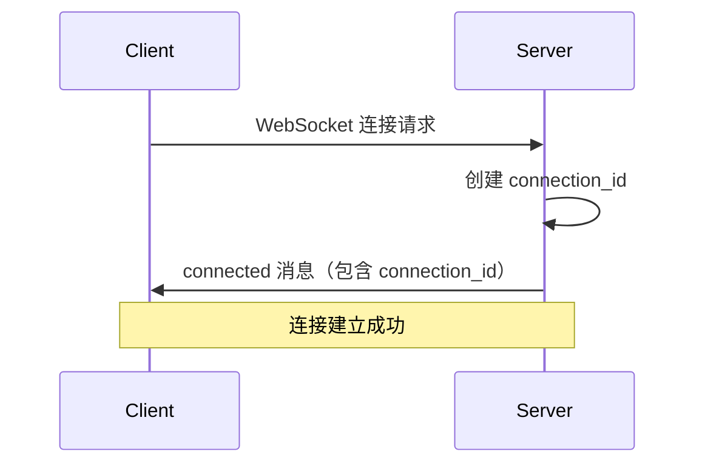
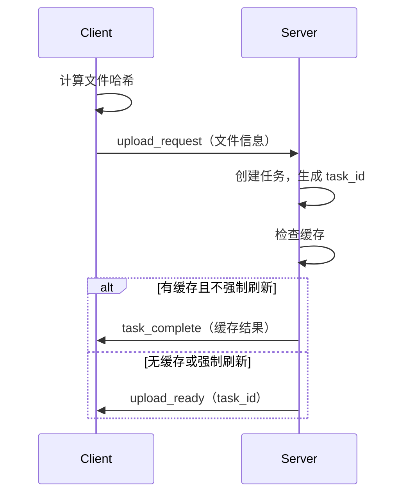
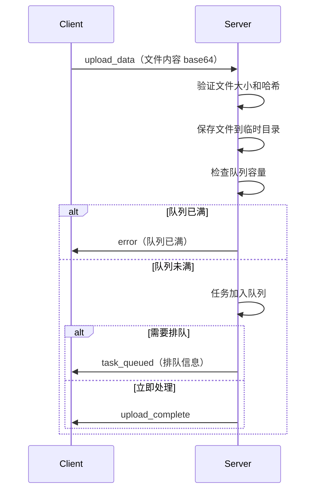
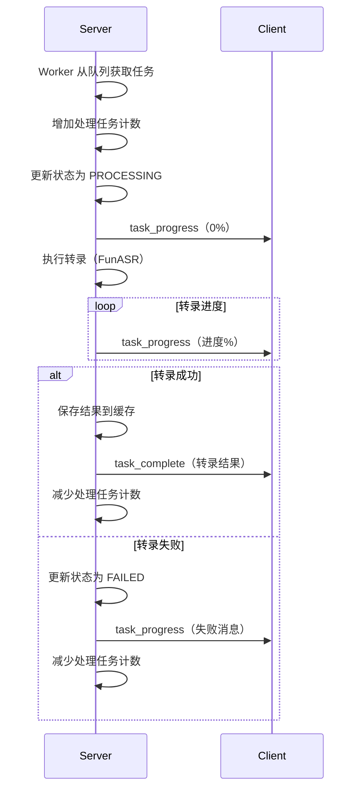
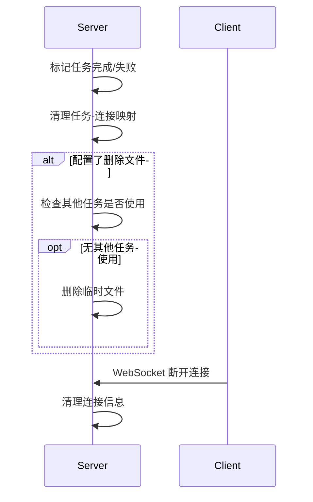

# Server-Client 交互流程文档

## 概述

本文档详细说明 FunASR 转录服务器与客户端之间的 WebSocket 交互流程，包括任务开始、处理和结束的完整控制机制。

## 核心组件

### Server 端
- **WebSocketHandler** (`src/api/websocket_handler.py`): 管理 WebSocket 连接和消息路由
- **TaskManager** (`src/core/task_manager.py`): 管理任务队列和生命周期

### Client 端
- **WebSocket 客户端**: 负责连接服务器、发送文件、接收结果

## 交互流程

### 1. 连接建立阶段



**关键代码位置**：
- Server: `websocket_handler.py:25-46` (handle_connection)
- Client: `test_server_transcription.py:39-66` (connect_to_server)

### 2. 任务创建阶段



**关键代码位置**：
- Client 发送请求: `test_server_transcription.py:152-164`
- Server 处理请求: `websocket_handler.py:142-213` (_handle_upload_request)
- Server 创建任务: `task_manager.py:55-76` (create_task)

### 3. 文件上传阶段



**关键代码位置**：
- Client 上传数据: `test_server_transcription.py:189-198`
- Server 处理上传: `websocket_handler.py:215-266` (_handle_upload_data)
- Server 提交任务: `task_manager.py:82-126` (submit_task)

### 4. 任务处理阶段



**关键代码位置**：
- Worker 处理: `task_manager.py:157-177` (_worker)
- 任务执行: `task_manager.py:179-312` (_process_task)
- 进度通知: `websocket_handler.py:310-345` (notify_task_progress)
- 完成通知: `websocket_handler.py:347-369` (notify_task_complete)

### 5. 任务结束与清理



**关键代码位置**：
- 任务完成处理: `task_manager.py:241-264`
- 连接清理: `websocket_handler.py:381-393` (_cleanup_connection)
- 文件清理: `task_manager.py:248-262`

## 任务状态管理

### 任务状态流转

```
PENDING（待处理） -> PROCESSING（处理中） -> COMPLETED（完成）
                                      \-> FAILED（失败）
                                      \-> CANCELLED（取消）
```

### 状态控制点

1. **任务创建时**：状态设为 PENDING
2. **开始处理时**：状态设为 PROCESSING
3. **处理完成时**：状态设为 COMPLETED
4. **处理失败时**：状态设为 FAILED
5. **用户取消时**：状态设为 CANCELLED

## 并发控制机制

### 1. 任务队列管理

- 使用 `asyncio.Queue(maxsize=50)` 管理待处理任务，防止内存溢出
- 配置 `max_concurrent_tasks=8` 控制并发数（基于CPU核心数优化）
- 配置 `max_queue_size=50` 限制队列最大长度
- Worker 线程池并发处理任务
- 实现排队状态通知和预估等待时间

### 2. 文件生命周期管理

- **文件去重**：基于文件哈希避免重复上传
- **引用计数**：多任务共享同一文件时，等所有任务完成后才删除
- **缓存策略**：相同文件直接返回缓存结果

**关键实现**：
```python
# task_manager.py:249-262
has_pending_tasks = any(
    t.file_hash == task.file_hash and 
    t.status in [TaskStatus.PENDING, TaskStatus.PROCESSING]
    for t in self.tasks.values()
    if t.task_id != task.task_id
)
if not has_pending_tasks:
    await delete_file(task.file_path)
```

### 3. 连接管理

- **连接映射**：维护 connection_id -> websocket 映射
- **任务关联**：维护 task_id -> connection_ids 映射
- **断线处理**：自动清理断开的连接
- **连接限制**：最大支持200个并发连接
- **心跳机制**：30秒间隔心跳检测
- **超时控制**：5分钟连接超时

## 错误处理与重试

### 1. 可重试错误

- VAD 算法错误
- 索引越界错误
- 模型临时错误

### 2. 不可重试错误

- 音频时长过短
- 文件不存在
- 文件格式不支持
- 认证失败

### 3. 重试机制

```python
# task_manager.py:279-290
if should_retry and task.retry_count < config.transcription.retry_times:
    task.retry_count += 1
    task.status = TaskStatus.PENDING
    await self.task_queue.put(task_id)
```

## 并发优化特性

### 1. 队列状态通知

当任务需要排队时，服务器会发送 `task_queued` 消息：

```json
{
  "type": "task_queued",
  "data": {
    "task_id": "xxx",
    "queue_position": 15,
    "estimated_wait_minutes": 30,
    "message": "文件上传成功，排队位置: 15"
  }
}
```

### 2. 动态负载均衡

- 支持运行时调整并发任务数
- 基于系统资源动态扩缩容
- 智能队列管理防止资源耗尽

### 3. 队列容量保护

- 队列满时拒绝新任务
- 防止内存溢出和系统崩溃
- 提供明确的错误信息

### 4. 统计信息增强

```python
# task_manager.get_stats() 返回信息
{
    "total_tasks": 100,
    "pending_tasks": 10,
    "processing_tasks": 8,
    "completed_tasks": 80,
    "failed_tasks": 2,
    "cancelled_tasks": 0,
    "queue_size": 10,
    "max_queue_size": 50,
    "max_concurrent_tasks": 8
}
```

## 客户端多进程释放建议

基于以上分析，客户端实现多进程释放需要注意：

### 1. 连接管理
- 每个进程独立维护 WebSocket 连接
- 避免跨进程共享 WebSocket 对象

### 2. 任务分配
- 主进程分配文件到各工作进程
- 工作进程独立完成上传和接收结果

### 3. 资源释放时机
- **任务完成后**：收到 `task_complete` 消息
- **任务失败后**：收到 `task_progress` 的失败状态
- **连接断开时**：WebSocket 异常或主动断开

### 4. 进程间通信
- 使用队列传递任务和结果
- 主进程汇总所有工作进程的结果

### 5. 异常处理
- 工作进程异常不影响其他进程
- 实现进程级别的重试机制

### 6. 客户端并发控制
- 根据服务器配置设置客户端并发数
- 监听 `task_queued` 消息调整发送频率
- 实现客户端侧限流避免服务器过载

## 示例代码结构

```python
# 多进程客户端示例结构（优化版）
class MultiProcessClient:
    def __init__(self, num_workers=4, max_queue_size=20):
        self.task_queue = multiprocessing.Queue(maxsize=max_queue_size)
        self.result_queue = multiprocessing.Queue()
        self.workers = []
        self.server_stats = None
        self.last_stats_time = 0
    
    async def check_server_load(self):
        """检查服务器负载"""
        current_time = time.time()
        if current_time - self.last_stats_time > 30:  # 30秒检查一次
            # 从服务器获取统计信息
            stats = await self.get_server_stats()
            if stats:
                queue_usage = stats['queue_size'] / stats['max_queue_size']
                if queue_usage > 0.8:  # 队列使用率超过80%
                    await asyncio.sleep(10)  # 延迟发送新任务
            self.last_stats_time = current_time
    
    def worker_process(self):
        """工作进程"""
        client = WebSocketClient()
        client.connect()
        
        while True:
            task = self.task_queue.get()
            if task is None:
                break
                
            try:
                result = client.process_file(task)
                
                # 处理排队响应
                if result.get('queued'):
                    print(f"任务排队: 位置 {result['queue_position']}, 预估等待 {result['estimated_wait']} 分钟")
                
                self.result_queue.put(result)
                
            except Exception as e:
                if "队列已满" in str(e):
                    print("服务器队列已满，等待后重试...")
                    time.sleep(30)  # 等待30秒后重试
                    self.task_queue.put(task)  # 重新加入队列
                else:
                    self.result_queue.put({"error": str(e)})
            finally:
                # 确保释放资源
                client.cleanup_task(task)
        
        client.disconnect()
    
    def cleanup_task(self, task):
        """清理任务资源"""
        # 释放文件句柄
        # 清理临时文件
        # 重置任务状态
        pass
    
    async def submit_with_backoff(self, task):
        """带退避策略的任务提交"""
        retry_count = 0
        max_retries = 3
        
        while retry_count < max_retries:
            try:
                await self.check_server_load()
                self.task_queue.put_nowait(task)
                return True
            except queue.Full:
                retry_count += 1
                wait_time = 2 ** retry_count  # 指数退避
                print(f"客户端队列已满，等待 {wait_time} 秒后重试...")
                await asyncio.sleep(wait_time)
        
        return False
```

## 注意事项

1. **心跳机制**：客户端使用 ping/pong 保持连接活跃（30秒间隔）
2. **超时控制**：长时间任务需要合理设置超时（默认5分钟）
3. **消息大小**：大文件传输需要设置合适的 max_size
4. **并发限制**：根据服务器配置控制客户端并发数（建议不超过8）
5. **队列监控**：客户端应监听队列状态，避免在服务器繁忙时过度提交
6. **资源清理**：及时处理 `task_complete` 和 `task_queued` 消息，释放客户端资源
7. **错误处理**：正确处理队列满错误，实现客户端重试机制

## 最佳实践配置

基于16核CPU的推荐配置：

```json
{
  "server": {
    "max_connections": 200,
    "connection_timeout_seconds": 300,
    "heartbeat_interval_seconds": 30
  },
  "transcription": {
    "max_concurrent_tasks": 8,
    "max_queue_size": 50,
    "queue_status_enabled": true,
    "load_balancing_enabled": true
  }
}
```

## 性能监控

使用 `task_manager.get_stats()` 监控系统负载：
- 队列长度超过80%时暂停接收新任务
- 处理任务数接近上限时启用限流
- 失败任务比例过高时检查系统状态